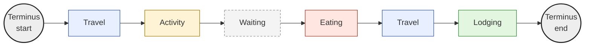
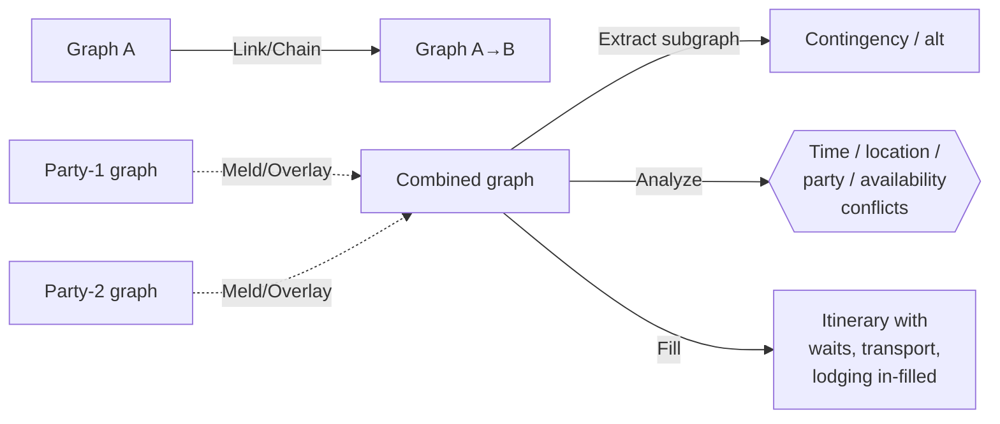
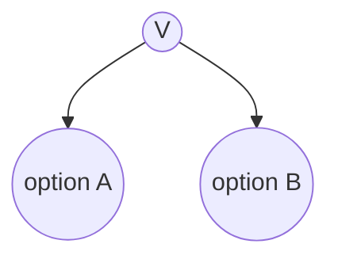
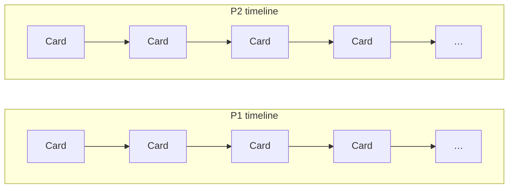
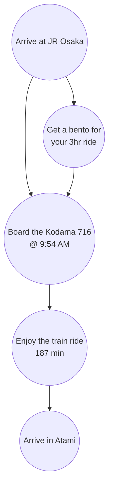
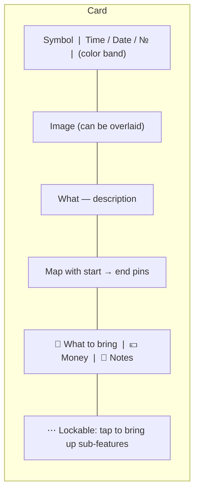
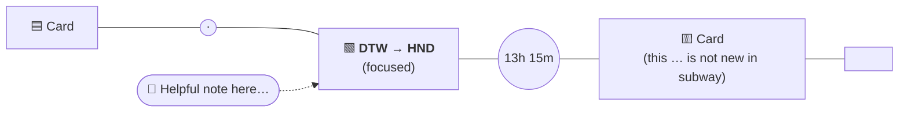
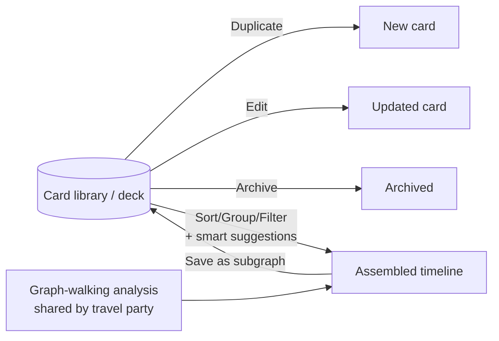
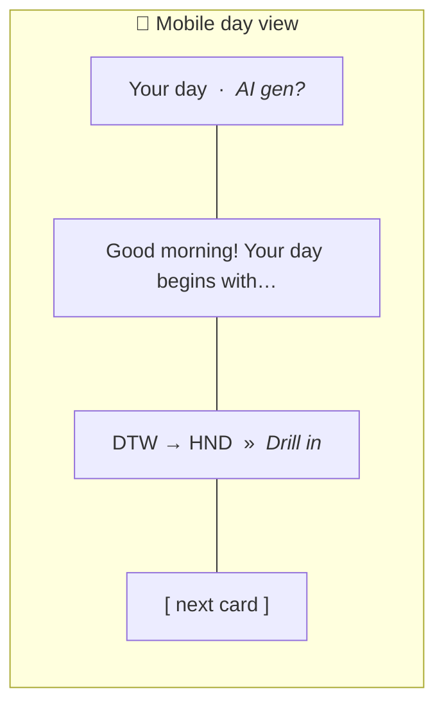

# Itinerary Planning System — Design Notes

Source: handwritten notebook pages, "Train notes" (5 pages, Sep 2024). This document transcribes the notes and recreates the diagrams in Mermaid.

---

## 1. Travel Graph (TG) — Tokaido

All plans in travel are modeled as a **digraph** where each vertex is one of:

- **Activity**
- **Travel** / Transportation
- **Waiting**
- **Lodging**
- **Eating**
- **Terminus**

Attributes on each node help in both the **visualization** and **plan analysis** aspects of itinerary planning.

### Ideas (motivating use cases)

- Walkthrough / preview
- Each-day prep video
- Fatigue tracker
- See where the other party is and their current modes

### Mandatory attributes (?)

- **Start / End time** (possible ranges?)
- **Location** — lat/lng + altitude? (subgraph for trails)
- **Type**

### Other attributes

- Money needed
- Optimal time of day
- Helpful phrases and signs you'll see
- Pictures and videos
- Links to websites
- Links / Plus codes
- Restrictions on age
- Restrictions for physicality
- Energy balance (+/−)
- Items you should have

### Intrinsic vs. layered attributes

Some attributes are **intrinsic** to the node and some are **layered over** by the individual custom itinerary, e.g.:

- Travelers
- Instantiated dates / times — `T+0, T+1, … T+N`

---

## 2. Travel Graph Ops

Creating an itinerary is a process of repeatedly performing a series of operations:

- **Linking — Chaining**
  The process of connecting graphs together.

- **Melding — Overlay**
  Graphs are zippered together. Activities are combined across travelers.
  *(Or do we just think of each traveler as having one's own? This would complicate editing.)*

- **Extracting**
  Pull a subgraph out to run coincident — prepare alternatives for contingencies or for other travelers.

- **Analyze**
  Walk the graph and look for:
  - Time non-linearities
  - Incompatibilities with travel party
  - Location-flux impossibility
  - Incompatibility with times open / available

- **Fill**
  Suggest in-fills of waiting, transport, lodging, etc. based on gaps.

---

## 3. Population of TG

- Need a way to **map existing inventory** onto a TG node. If from external systems, then a mechanism to **sync** is needed as well.
- A mapping should exist between our itinerary and these nodes.
- We probably **don't need a graph DB** — but it's possible for branch points.

---

## 4. Vertex — Branching

Each vertex `V` represents the possibility of transitioning to another node.

> Two possibilities present in this situation.

---

## 5. Timeline Walking

We can walk the **linearization** of the graph between any two points in time for various types of analysis:

- What should I bring with me today?
- What level of physical exertion will each person feel throughout the day?
- Where will we go on a map?
- What vocabulary and signs should I know today?

---

## 6. Card Linearization — Timeline

The graph can be converted into a **totally ordered representation**. Each party gets its own timeline, assuming none of our constraints were violated.

---

## 7. The Case for Subgraphs

Within a particular activity, it will be helpful to have **subgraphs (SGs)** to make composition easier. Operators (e.g. providers) make SGs that we compose into voyages.

### Example — Shinkansen JR Osaka → Atami

The bento step branches off the main path and rejoins — i.e. it's optional / parallel.

> **You can always create a card from any sub-graph.**

### Symbols (legend)

| Symbol | Meaning |
|---|---|
| 🚄 | Train |
| 🚇 | Subway |
| 🚗 | Car |
| ⏳ | Wait |
| 🏨 | Hotel |
| 🍽️ | Meal |

---

## 8. Card — "A blend of art and structure"

A **card** is the user-facing unit. It should:

- Fit on a phone screen
- Use a common layout for viewing **and** editing
- Live in a card library — making customization of an itinerary easy

### Anatomy of a card

Visual layout (from sketch):

| Region | Content |
|---|---|
| Top-left | **Symbol** (mode icon) |
| Top-right | **Color** band (theme/category) |
| Top center | **Time / Date / №** |
| Body | **Image** (can be embedded) |
| Mid | **What** — description |
| Lower body | **Map** with origin & destination pins |
| Footer | What to bring · Money needed · Notes |
| Bottom | "Lockable" — tap to open sub-features |

A second sketched example shows a card for **"TGV 113 from Aurora RDS"** with a map showing a subway-line / Shinkansen route between two pinned locations and an `OK` button. Annotation: *"Editor can see all of these and fill them in one by one."*

---

## 9. Voyage Visualization (Horizontal)

Cards laid out left-to-right along a timeline. The currently focused card is enlarged in the middle; the time-gap to the next card is annotated on the connecting line; cards can host helpful notes that pop out as bubbles.

Sketch annotations transcribed:

- Middle (focused) card: **"DTW → HND"** with a speech bubble "Helpful note here…"
- Time-gap label between middle and right cards: **"13h 15m"**
- Right card carries a callout like **"This … is not new in subway"** (i.e. content that would be unfamiliar in this mode)

---

## 10. Cards as Unit of Itinerary Management

Operators are effectively curating a **library (deck)** of these cards through ops like:

- **Duplicate**
- **Edit**
- **Archive**

By presenting this deck and allowing **smart suggestions, sorting, grouping, filtering**, operators assemble them into timelines the **same way users see them**.

> **See subgraph idea** — these strings of cards can be saved together.

All of the same travel-planning intelligence from graph walking can be made available (by the travel party, if shared) to the operators to produce a HQ itinerary during customization.

---

## 11. Visual Concepts

- **Subtle imagery behind the timeline** that fades into one another as one scrolls.
- **Play off the conversation theme** — have an AI agent (working name: *Artemis*?) avatar point out interesting things or problems to resolve.
- **Mobile companion** presents the day view in this same way.

### Mobile day-view sketch

> Reminds me of Apple Wallet a bit.

---

## Glossary

| Term | Meaning |
|---|---|
| **TG** | Travel Graph — the digraph representing a trip |
| **Vertex / Node** | A discrete state along the trip (Activity, Travel, Waiting, Lodging, Eating, Terminus) |
| **Subgraph (SG)** | A reusable, named cluster of nodes (e.g. a particular Shinkansen leg) |
| **Linearization** | A totally-ordered walk through the graph for one party between two times |
| **Card** | The phone-sized, user-facing rendering of one node or subgraph |
| **Deck / Library** | The operator's collection of cards/subgraphs that can be composed |
| **Voyage** | A composed, customized itinerary built from cards/subgraphs |
| **Operator** | The travel-planning provider curating cards and assembling itineraries |
| **Party** | A traveler or group of travelers; each has its own timeline |
