# Japan Trip – Final Itinerary (Item-by-Item Breakdown)

Source: *2024_06.20_Semi-Final-Itinerary_Christopher-Myers (as of 07 JUN) — Heartland JAPAN / Outdoor Voyage*
Travelers: Christopher Myers, party of 4
Duration: 15 days — 20 Jun 2024 (Thu) → 4 Jul 2024 (Thu)

> Image paths are relative to this file (`images/…`). Coordinates are approximate decimal-degree (lat, lng) values for the specific venue named; for apartments I list the coordinates of the address block.

---

## Trip Summary

| Line Item | JPY | USD (for info) |
|---|---|---|
| ① Total (transport / accommodation / activities / guide / entry / meals / service fee) | ¥1,586,800 | $10,104.58 |
| Per person | ¥396,700 | $2,526.15 |
| Per person per day (avg) | ¥26,447 | $168.41 |
| ③ USJ Ticket 1-day (Adult) × 4 | ¥9,400 × 4 = ¥37,600 | Added on |
| ④ USJ Express Pass (Adult) × 4 | ¥12,800 × 4 = ¥51,200 | Added on |
| **Grand Total** | **¥1,675,600** | — |

**Payment Schedule**

- 25% deposit: ¥397,900 — **PAID**
- Balance: ¥1,277,700 — **due 15 June 2024**
- Grand Total: ¥1,675,600

Notes: prices include 10% consumption tax; payment in JPY only (Flywire recommended); bank transfer adds ¥6,500/group supplement.

**Operator & Emergency Contacts**

- Heartland JAPAN — Tomo Baba, Minami-cho 15-206, Shinjuku-ku, Tokyo 162-0836 — tour_ops@heartlandjapan.com — +81-(0)3-6265-3294
- 24h emergency: Nobuko Masuda 090-5447-6883 / Noriko Oshima 080-8853-7769 (LINE / Messenger also)

---

## DAY 1 — Thursday, 20 June 2024 — Arrive Tokyo

**Includes:** apartment accommodation · English-speaking airport assistant (Haneda → apartment) · IC card loaded with ¥15,000

**Overview:** Arrival day. The airport assistant meets you, transfers you to the apartment via local train, hands over the IC card, helps validate the JR Pass, and helps you check in. Rest of the day is free.

### Items

1. **16:10 — Arrive at Tokyo International (Haneda) Airport on Delta DL275**
   - Full name: 東京国際空港 (羽田空港) / Haneda Airport, Ota-ku, Tokyo
   - (35.5494, 139.7798)
   - Use Visit Japan Web for quick immigration, **but** go through a staffed counter (not the automated gate) so you receive the "Temporary Visitor" entry stamp required to redeem the JR Pass.

   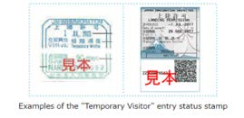

2. **Meet airport assistant at arrival exit** — Mr. Takebayashi Kei, TEL 080-3094-0463.
   - Shows you how to use the IC card, validates JR Pass, escorts you to the apartment.
   - Present your JR Rail Pass Exchange voucher and passport.

3. **Haneda → apartment via Keikyu Airport Line Express (≈1 h 19 min)** — IC card.

4. **Arrive at apartment; assistant helps with self-check-in, then service ends.**
   - Print the check-in instruction beforehand: http://firestorage.com/download/7630347ab154401add69ca673f415227eb7f6122
   - **Dinner:** excluded.

5. **Accommodation — Apartment in Shin-Nakano**
   - 401 Central Field, 6-21-16 Honmachi, Nakano-ku, Tokyo (中野区本町6-21-16)
   - (35.6930, 139.6662)
   - Room type: one-bedroom apartment, 2 double beds.

   

---

## DAY 2 — Friday, 21 June 2024 — Tokyo: Tsukiji + Asakusa + Sumo + Samurai/Ninja

**Includes:** apartment accommodation · English-speaking guide · Tsukiji morning food tour · Sumo show with lunch · Samurai sword & ninja experience (lunch INC).

**Overview:** Guided cultural day: Tsukiji food tour, Asakusa (Nakamise-dori + Sensoji), Sumo-show lunch, then Samurai/Ninja experience back in Asakusa.

### Items

1. **07:40 — Guide meets you at the apartment** — Mr. Takebayashi Kei, 080-3094-0463.
2. **08:08 — Local train to Tsukijishijo Station (築地市場駅)** — IC card.
   - (35.6646, 139.7709)
3. **08:30 — Morning food tour at Tsukiji Outer Market (築地場外市場)**
   - Tsukiji Outer Market, Chuo-ku, Tokyo
   - (35.6654, 139.7707)
   - Tasting of traditional Japanese breakfast fare with an expert guide.

   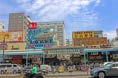

4. **10:00 — Tsukiji → Asakusa by subway** — IC card.
5. **10:16 — Asakusa (Nakamise-dori 仲見世通り & Sensō-ji 浅草寺)**
   - Sensō-ji Temple, 2-3-1 Asakusa, Taito-ku, Tokyo
   - (35.7148, 139.7967)
   - Kaminarimon gate; walk Nakamise Street; try imo-kintsuba and ningyō-yaki.

   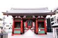

6. **Walk ≈5 min to the sumo stable.**
7. **12:00 — Asakusa Sumo Club (Sumo show + Chanko-nabe lunch, ≈2 h)**
   - Reservation: Mr. Christopher Myers
   - Asakusa area, Taito-ku, Tokyo (≈35.7166, 139.7978)
   - Lunch INC — chanko-nabe with (retired) sumo wrestlers.

   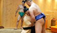

8. **15:00 — Travel back to Asakusa** — IC card.
9. **16:00 — Samurai Sword & Ninja Experience (Order #S535502, ≈75 min)**
   - Samurai Ninja Museum / Experience — Asakusa area, Taito-ku, Tokyo
   - (≈35.7104, 139.7970)
   - Dress in samurai attire, katana handling, ninja demo.

   

10. **17:30 — Guide escorts you back to the apartment.**
11. **18:00 — End of guide service. Dinner: excluded.**
12. **Accommodation — Apartment in Shin-Nakano** (same as Day 1 — see above).

   

---

## DAY 3 — Saturday, 22 June 2024 — Tokyo free day (anime / arcade / cat café)

**Includes:** apartment accommodation. No guide.

**Overview:** Self-guided Tokyo. Cat café in Shinjuku → Square Enix "Artnia" → Namco arcade in Shinjuku → optional Animate flagship in Ikebukuro.

### Items

1. **Self-guided travel to Shinjuku-Sanchome Station** — IC card.
   - Tokyo Metro Marunouchi Line from Shin-Nakano → Shinjuku-Sanchome (≈7 min, 4 stops)
   - Shinjuku-Sanchome Station: (35.6917, 139.7052)

2. **Suggestion 1 — MOCHA Lounge Shinjuku Store** (cat café, no reservations)
   - Shinjuku Pegasus Building 6F, 3-31-5 Shinjuku, Shinjuku-ku, Tokyo
   - (35.6910, 139.7052)
   - Hours 10:00–20:00 (last entry 19:30); ¥200 / 10 min / person, pay on site.

   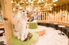

3. **Suggestion 2 — Artnia (New Square Enix Shop & Café)** — walk ≈15 min
   - Shinjuku East Side Square 1F, 6-27-30 Shinjuku, Shinjuku-ku, Tokyo
   - (35.6934, 139.7098)
   - 11:00–21:00 (food L.O. 20:00, drink L.O. 20:30). *Cafe reservation required* — book yourself: https://www.jp.square-enix.com/cafe/tokyo/pc/reserve/index.php
   - **Lunch:** excluded.

   

4. **Suggestion 3 — Namco TOKYO (arcade)**
   - Tokyu Kabukicho Tower 3F, 1-29-1 Kabukicho, Shinjuku-ku, Tokyo
   - (35.6950, 139.7019)
   - 11:00–25:00 (food L.O. 24:00, drink L.O. 24:30); features a 3.3 m "Big Crane" machine with jumbo prizes.

   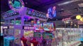

5. **Suggestion 4 — Animate Ikebukuro Main Store**
   - 1-20-7 Higashi-Ikebukuro, Toshima-ku, Tokyo
   - (35.7312, 139.7167)
   - 9-story anime/manga flagship, renovated 2023.

   

6. **Back to the apartment** — IC card. **Dinner:** excluded.
7. **Accommodation — Apartment in Shin-Nakano** (same address).

   

---

## DAY 4 — Sunday, 23 June 2024 — teamLab Planets + Tokyo Dome baseball

**Includes:** apartment accommodation · English-speaking guide · teamLab Planets admission · baseball ticket.

**Overview:** Guided: teamLab Planets TOKYO DMM (Toyosu), then pro baseball at Tokyo Dome — Yomiuri Giants vs Tokyo Yakult Swallows.

### Items

1. **07:50 — Guide meets you at apartment** — Mr. Kei Takebayashi, 080-3094-0463.
2. **Train from apartment to teamLab (≈1 h)** — IC card.
3. **09:00 — teamLab Planets TOKYO DMM (チームラボプラネッツ)**
   - 6-1-16 Toyosu, Koto-ku, Tokyo 135-0061
   - (35.6498, 139.7920)
   - Entry window 09:00–09:30. Bring student ID if applicable.
   - Immersive, full-body digital art; you will get wet (free towels).

   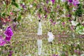

4. **11:00 — Train to Tokyo Dome (≈40 min)** — IC card. **Lunch:** excluded.
5. **12:00 — Tokyo Dome (東京ドーム, "Big Egg")**
   - 1-3-61 Koraku, Bunkyo-ku, Tokyo 112-0004
   - (35.7056, 139.7519)

   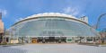

6. **14:00 — Baseball: Yomiuri Giants vs Tokyo Yakult Swallows**
   - NPB Central League at Tokyo Dome.

   

7. **Back to apartment — guide ends service at hotel/city center. Dinner: excluded.**
8. **Accommodation — Apartment in Shin-Nakano** (same).

   

---

## DAY 5 — Monday, 24 June 2024 — Tokyo → Kyoto (Shinkansen) + Arashiyama

**Includes:** apartment accommodation. No guide.

**Overview:** Hikari #635 Shinkansen from Shinagawa to Kyoto; drop bags at RESI STAY reception; Arashiyama Bamboo Grove + Iwatayama Monkey Park; check in after 15:00.

### Items

1. **Check out Shin-Nakano apartment; metro to Shinagawa Station** (IC card + JR Yamanote Line).
   - Shinagawa Station (JR): (35.6285, 139.7387)
2. **08:40 — Shinkansen Hikari #635 from Shinagawa to Kyoto** (JR Pass; reserve adjacent seats).
   - *NB: Nozomi / Mizuho are NOT covered by the standard JR Pass unless separately ticketed.*
3. **11:13 — Arrive at Kyoto Station (京都駅)**
   - (34.9859, 135.7585)
4. **Walk ≈5 min to RESI STAY Reception Counter, leave luggage.**
   - RESI STAY Reception Counter, 5F (near Kyoto Tower / Karasuma-dori)
   - (≈34.9873, 135.7589) — Shiokoji-dori / Karasuma-dori area just north of Kyoto Station
   - Hours 08:00–20:00. https://resistay.jp/en/reception/
   - Apartment check-in begins 15:00.

   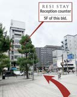

   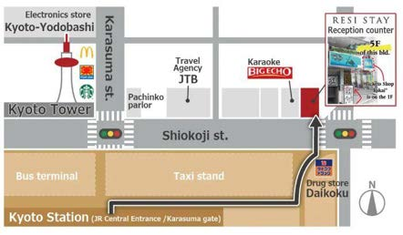

5. **Suggestion 1 — Arashiyama Bamboo Grove (嵯峨野竹林 / 嵐山)**
   - JR Sagano Line to Saga-Arashiyama Station (JR Pass).
   - Saga-Arashiyama Station: (35.0191, 135.6799)
   - Bamboo Grove: (35.0170, 135.6717) — Ukyo-ku, Kyoto 616-8385

   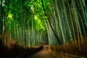

6. **Suggestion 2 — Arashiyama Monkey Park Iwatayama (嵐山モンキーパークいわたやま)**
   - 8 Arashiyama Genrokuzancho, Nishikyo-ku, Kyoto 616-0004
   - (35.0105, 135.6758)
   - Admission (pay on site): Adult ¥600, child (4–15) ¥300. ~120 wild Japanese macaques.

   

7. **JR Sagano Line back to Kyoto Station** (JR Pass). Pick up luggage at RESI STAY reception (closes 20:00); passport & voucher required. Transfer to apartment after 15:00 — IC card. **Dinner:** excluded.

8. **Accommodation — RESI STAY Apartment Kyoto**
   - 558-9 Motoshiogamachō, Shimogyō-ku, Kyoto
   - (34.9889, 135.7575)
   - Room: one-room unit, 2 double beds + 1 sofa bed. Check-in procedure notified the day before.

   

---

## DAY 6 — Tuesday, 25 June 2024 — Fushimi Inari + Nara day-trip + Sumi ink experience

**Includes:** apartment accommodation · Gripped Sumi (ink stick) experience fee.

**Overview:** Self-guided morning hike at Fushimi Inari → Kintetsu train to Nara → Nara Park + Todaiji + Naramachi → 17:00 Sumi-ink experience at Kinkoen (Nara) → JR back to Kyoto.

### Items

1. **Suggestion 1 — Light morning hike at Fushimi Inari Taisha (伏見稲荷大社)**
   - 68 Fukakusa Yabunouchicho, Fushimi-ku, Kyoto 612-0882
   - (34.9671, 135.7727)
   - ~4 km circuit up Mt. Inari (233 m); the Senbon Torii vermilion tunnel.

   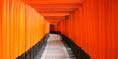

2. **09:25 — Train Kyoto → Kintetsu-Nara Station (近鉄奈良駅)** (~46 min; Kintetsu line, **not JR** — use IC card).
3. **10:11 — Arrive Kintetsu-Nara Station**
   - (34.6830, 135.8280)
   - **Lunch:** excluded.
4. **Suggestion 2 — Nara Park (奈良公園)**
   - Nara, Nara Prefecture 630-8212
   - (34.6851, 135.8430)
   - 660 ha; famous free-roaming sika deer.

   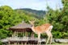

5. **Suggestion 3 — Tōdai-ji (東大寺) / Daibutsu-den**
   - 406-1 Zoshicho, Nara 630-8587
   - (34.6889, 135.8398)
   - Great Buddha Hall — one of the world's largest wooden structures.

   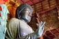

6. **Suggestion 3b — Light meal in Naramachi (ならまち)**
   - Old town district south of Sarusawa Pond, Nara
   - (34.6780, 135.8289)

   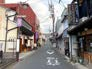

7. **17:00 — Gripped Sumi (ink stick) experience at Kinkōen (錦光園)** — *be punctual*
   - 547 Sanjo-cho, Nara City, Nara Prefecture
   - (34.6825, 135.8290)
   - +81-742-22-3319
   - Hand-kneading of raw Nara sumi ink — feel the softness/warmth of fresh ink in your palm.

   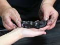

8. **18:00 — Dinner: excluded. Return to Kyoto** via JR (JR Pass / IC card).
9. **Accommodation — RESI STAY Apartment Kyoto** (same as Day 5).

   

---

## DAY 7 — Wednesday, 26 June 2024 — Kyoto → Hiroshima + Peace Park cycling tour

**Includes:** apartment accommodation · cycling tour.

**Overview:** Check out Kyoto; taxi to Kyoto Station; Shinkansen Hikari #535 to Hiroshima; afternoon Peace Ride cycling tour with English-speaking guide (sokoiko!) around Peace Memorial Park & A-Bomb Dome.

### Items

1. **Check out of Kyoto apartment — taxi to JR Kyoto Station** (arrange + pay on site).
2. **08:00 — Arrive Kyoto Station.**
3. **08:29 — Shinkansen Hikari #535 Kyoto → Hiroshima (≈124 min)** (JR Pass; reserve adjacent seats).
4. **10:33 — Arrive Hiroshima Station (広島駅)**
   - (34.3979, 132.4750)
   - Leave luggage at coin locker or **Crosta Hiroshima** (1F, next to lockers). **Lunch:** excluded.

   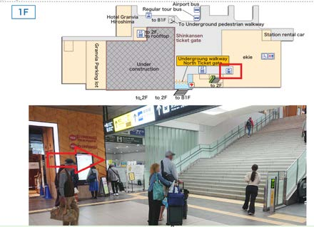

5. **Transfer to Peace Memorial Park Rest House (shared tour — arrive on time).**
   - Peace Memorial Park Rest House (広島平和記念公園レストハウス)
   - 1-1 Nakajimacho, Naka-ku, Hiroshima 730-0811
   - (34.3932, 132.4527)

   

6. **15:00 — "Hiroshima Cycling Peace" Shared Tour by sokoiko! (≈2 h, e-bike, English guide)** — included.
   - Route covers the Atomic Bomb Dome, Peace Park, and lesser-known war-related sites with a local guide.

   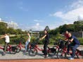

7. **17:00 — Tour ends at Hiroshima Prefectural Citizens Culture Center**
   - 3-1 Ōtemachi, Naka-ku, Hiroshima 730-0051
   - (34.3937, 132.4579)

8. **Tram back to Hiroshima Station** (Hiroshima Electric Railway "Hiroden"; see https://www.hiroden.co.jp/en/s-howtoride.html). Pick up luggage, then to the apartment (nearest tram stop: Hatchobori, ~5 min walk). **Dinner:** excluded.

   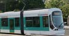

9. **Accommodation — Apartment Hiroshima**
   - #402, Nikkei Building, 12-2 Hatchōbori, Naka Ward, Hiroshima 730-0013
   - (34.3953, 132.4638)
   - Room: 3 queen beds, 1 double bed, 1 single bed. Check-in procedure informed day-of.

   

---

## DAY 8 — Thursday, 27 June 2024 — Miyajima: Itsukushima + Sea Kayak

**Includes:** apartment accommodation · English-speaking guide (10:40–19:00) · sea-kayak experience (insurance, kayak, paddle, life jacket, water shoes, weather-appropriate clothing) · Itsukushima Shrine admission.

**Overview:** Train + ferry to Miyajima Island; 2.5-hour sea kayak tour meeting at Nagahama Shrine Torii; Itsukushima Shrine; return to Hiroshima; suggested dinner at Okonomimura.

### Items

1. **10:40 — Guide meets at apartment** — Mr. Eijiro Kurisaka, 090-6832-1953.
2. **10:56 — Walk to Hatchobori Station; Hiroden tram → Hiroden Nishi-Hiroshima (28 min)** — IC card.
   - Hiroden Nishi-Hiroshima Station: (34.3973, 132.4428)
3. **11:15 — Transfer to JR: Nishi-Hiroshima → Miyajimaguchi (19 min)** — JR Pass.
4. **11:41 — Arrive Miyajimaguchi Station.** **Lunch:** excluded.
5. **12:55 — JR ferry Miyajimaguchi Port → Miyajima (≈10 min)** — JR Pass.
   - Miyajimaguchi Station/Port: (34.3083, 132.3021)
6. **13:05 — Arrive Miyajima; walk ≈5 min to the kayak meeting point.**
7. **13:30 — Sea Kayak Experience (2.5 h, included).**
   - Meeting point: **Nagahama Shrine Torii (長浜神社 鳥居)**
   - Miyajimacho, Hatsukaichi, Hiroshima 739-0588
   - (≈34.2990, 132.3165)
   - Bring: water, sunscreen, hat, sunglasses, towel, change of clothes.

   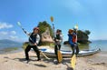

8. **16:00 — End of kayaking; walk ≈15 min to Itsukushima Shrine.**
9. **16:30 — Itsukushima Jinja (厳島神社)** — admission included.
   - 1-1 Miyajimacho, Hatsukaichi, Hiroshima 739-0588
   - (34.2960, 132.3199)
   - UNESCO-listed shrine over the sea (1996); the great vermilion torii.

   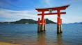

10. **17:40 — Ferry Miyajima Port → Miyajimaguchi (≈10 min)** — JR Pass.
11. **17:54 — Hiroden tram Miyajimaguchi → Hatchobori (≈62 min)** — IC card.
12. **18:56 — Arrive at apartment; guide ends service.** **Dinner:** excluded.
13. **Suggestion — Okonomimura (お好み村)** for Hiroshima-style okonomiyaki.
    - 5-13 Shintenchi, Naka Ward, Hiroshima 730-0034
    - (34.3929, 132.4618)
    - 23 okonomiyaki stalls across 4 floors; the present building opened 1992.

   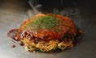

14. **Accommodation — Apartment Hiroshima** (same as Day 7).

   

---

## DAY 9 — Friday, 28 June 2024 — Takehara + Okunoshima ("Rabbit Island")

**Includes:** apartment accommodation · English-speaking tour assistant (apartment 08:40 → Hatchobori bus stop 09:05) · English-speaking tour guide (Tadanoumi Station 10:42 → Tadanoumi bus stop 16:34) · ferry tickets.

**Overview:** Highway bus to Tadanoumi; ferry to Okunoshima (wild rabbits + WWII poison-gas-plant ruins); ferry back; explore Takehara old town (Edo-era sake/salt district); bus back to Hiroshima.

### Items

1. **08:40 — Meet assistant at apartment** — Ms. Twombly Mika, 050-1808-2269.
2. **Walk ≈5 min to Mitsukoshimae Parking bus stop, Hatchobori.**
3. **09:05 — Highway bus Hatchobori → Tadanoumi Station (≈97 min)** — IC card.

   

4. **10:42 — Arrive Tadanoumi Station (忠海駅)**
   - (34.3425, 132.9432)
   - Meet guide: Ms. Junko Mills, 090-6960-2158.
   - **Lunch:** excluded.
5. **12:00 — Ferry Tadanoumi Port → Okunoshima (≈15 min, paid by guide)**
   - Tadanoumi Port: (34.3424, 132.9521)

   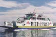

6. **12:15 — Arrive Okunoshima (大久野島 / "Rabbit Island")**
   - Tadanoumicho, Takehara, Hiroshima 729-2311
   - (34.3102, 132.9845)
   - Seto Inland Sea national park; 700+ wild rabbits; WWII ruins.

   

7. **13:48 — Ferry Okunoshima → Tadanoumi Port (≈15 min, paid by guide).**
8. **14:00 — Arrive Tadanoumi Port; visit Takehara (竹原) historic preservation district.**
   - Takehara old town: (34.3416, 132.9080)
   - "Little Kyoto of Hiroshima" — Edo-period sake breweries & salt merchants' houses. Bamboo-craft workshop and G7 Hiroshima Summit sake shop included.

   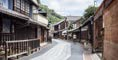

9. **16:34 — Express bus Tadanoumi Station → Hatchobori** — IC card.
10. **18:15 — Arrive Hatchobori; walk ≈5 min to apartment (no guide).** **Dinner:** excluded.
11. **Accommodation — Apartment Hiroshima** (same).

   

---

## DAY 10 — Saturday, 29 June 2024 — Hiroshima → Osaka + Osaka sightseeing + Zen meditation

**Includes:** hotel (city/bath tax excluded, pay on site) · Zen-meditation experience (free to Shukubo guests).

**Overview:** Shinkansen Sakura #544 to Shin-Osaka; drop bags at Shukubo; self-guided Osaka Castle + Shinsekai (Kushikatsu) + Dotonbori; 20:30 Zen meditation at Waqoo Shitaderamachi.

### Items

1. **Check out Hiroshima apartment; walk ≈10 min to Hatchobori Station.**
2. **09:35 — Hiroden tram Hatchobori → Hiroshima Station (≈13 min)** — IC card.
3. **Walk ≈10 min to JR Hiroshima Station.**
4. **10:33 — Shinkansen Sakura #544 Hiroshima → Shin-Osaka (≈86 min)** (JR Pass; reserve adjacent seats).
5. **11:59 — Shin-Osaka Station (新大阪駅)**
   - (34.7333, 135.5000)
6. **12:14 — JR local Shin-Osaka → Osaka Station (~4 min)** — JR Pass.
   - JR Osaka Station: (34.7024, 135.4959)
7. **Walk ≈10 min to Higashi-Umeda Station (Tanimachi Line).**
8. **12:35 — Subway Higashi-Umeda → Shitennoji-mae Yuhigaoka (≈12 min)** — IC card.
   - Shitennoji-mae Yuhigaoka Station: (34.6546, 135.5187)
9. **Walk ≈10 min to the Shukubo; drop luggage (check-in from 15:00).** **Lunch:** excluded.

10. **Suggestion — Osaka Castle (大阪城 / Osaka-jō)**
    - 1-1 Osakajo, Chuo-ku, Osaka 540-0002
    - (34.6873, 135.5259)

   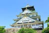

11. **Suggestion — Shinsekai (新世界) & Tsutenkaku Tower (通天閣)**
    - Naniwa-ku, Osaka
    - (34.6525, 135.5063)

   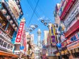

12. **Suggestion — Lunch: Kushikatsu (串カツ)** — Osaka specialty (don't double-dip the sauce).

   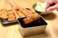

13. **Suggestion — Dotonbori (道頓堀)**
    - Chuo-ku, Osaka
    - (34.6686, 135.5016)

   

14. **Back to the Shukubo by public transport. Dinner:** excluded.
15. **20:30 — Zen Meditation (Zazen) — shared, included**
    - Meet at front desk around 20:20. Instruction provided by a visiting priest. May move online if a memorial service comes up.

   

   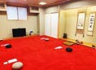

16. **Accommodation — Waqoo Shitaderamachi (和空下寺町 Shukubo)**
    - 2-17-8 Shitaderamachi, Tennoji-ku, Osaka 543-0076
    - (34.6584, 135.5178)
    - Room: Superior twin, 17.5–18.38 m² × 2 rooms.

   

---

## DAY 11 — Sunday, 30 June 2024 — Universal Studios Japan

**Includes:** apartment accommodation · USJ 1-day ticket + Express Pass (shown as SPL; billed separately). Breakfast INC at Shukubo.

**Overview:** Shukubo → JR Osaka Station; bags at Crosta Osaka; train to Universal City; full day at USJ; retrieve bags; subway to Daikokucho; check in at Osaka apartment.

### Items

1. **Breakfast at the Shukubo.**
2. **08:40 — Check out Shukubo; walk ≈10 min to Shitennoji-mae Yuhigaoka Station.**
3. **08:59 — Subway Shitennoji-mae Yuhigaoka → Higashi-Umeda (12 min)** — IC card.
4. **09:11 — Arrive Higashi-Umeda; walk ≈10 min to JR Osaka Station.**
5. **Drop luggage at Crosta Osaka** (inside Osaka Station 1F, next to Nippon Travel Agency, outside Shin-Osaka ticket gate). Pay on site. Open 08:00–20:00. https://maps.app.goo.gl/mrmALuMxVsMX8mBx9

   

   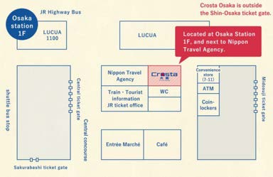

6. **09:46 — JR Osaka → Universal City Station (11 min)** — JR Pass.
   - Universal City Station: (34.6671, 135.4415)
7. **09:58–~19:00 — Universal Studios Japan (USJ)**
   - 2-1-33 Sakurajima, Konohana Ward, Osaka 554-0031
   - (34.6657, 135.4324)
   - Open 09:00–19:00; 10 sections including Super Nintendo World and Wizarding World of Harry Potter.

   

8. **Lunch:** excluded (at park).
9. **19:08 — Universal City → JR Osaka (11 min)** — JR Pass.
10. **Crosta Osaka — pick up luggage by 20:00.**
11. **Walk ≈5 min to Umeda Station (Midosuji subway).**
12. **19:41 — Subway Umeda → Daikokucho (11 min)** — IC card.
    - Daikokucho Station: (34.6616, 135.5002)
13. **19:52 — Walk ≈5 min to apartment; check in. Dinner:** excluded.
14. **Accommodation — Apartment in Osaka**
    - 1-chōme-6-4 Shikitsunishi 3F, Naniwa Ward, Osaka 556-0015
    - (34.6488, 135.4913)
    - Room: 2-bedroom unit, 4 double beds + 1 single. Check-in procedure notified day-of.

   

---

## DAY 12 — Monday, 1 July 2024 — Osaka → Mishima → Kawaguchiko → Mt. Fuji 5th Station (climb begins)

**Includes:** hotel (city/bath tax excluded, pay on site) · highway bus tickets Mishima Station → Kawaguchiko Station · Mt. Fuji entrance fee (¥2,000/pp, included).

**Overview:** Bullet train to Mishima; highway bus to Kawaguchiko; local bus up to Fuji Subaru Line 5th Station; check into Fujikyu Unjokaku (capsule lodge); start climbing 21:00–02:00 to reach summit for sunrise (~04:30).

### Items

1. **Check out Osaka apartment; walk ≈10 min to Daikokucho Station.**
2. **08:40 — Midosuji subway Daikokucho → Shin-Osaka (19 min)** — IC card.
3. **08:59 — Arrive Shin-Osaka (Midosuji); walk ≈5 min to JR Shin-Osaka Station.**
4. **Crosta Shin-Osaka / TA-Q-BIN — send your large luggage ahead to Tokyo (pay on site).**
   - Ship to: **Yamato Transport Seijo Office**, 1 Chome-4-19 Seijo, Setagaya City, Tokyo 157-0066. Specify arrival date **2 July, AM or 14:00–16:00**. Pack 1-night bag for Fuji.
   - 〒157-0066 東京都世田谷区成城１丁目４−１９ ヤマト運輸 成城営業所 着日指定: 7/2 AM or 14時–16時
   - https://maps.app.goo.gl/PinTVn1Zk27xFaYk8

   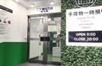

   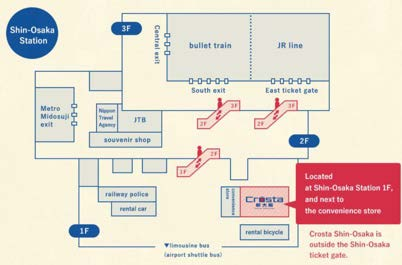

5. **09:48 — Shinkansen Hikari #502 Shin-Osaka → Mishima (129 min)** (JR Pass; reserve adjacent seats).
6. **11:57 — Arrive Mishima Station (三島駅), Shizuoka**
   - (35.1266, 138.9115)
   - **Lunch:** excluded. Buy climbing food here (most 5th-station shops close at 17:00).

7. **13:20 — Highway bus "Limited Express Mishima-Kawaguchiko Liner" Mishima → Kawaguchiko (~1.5 h)**
   - Reservation WR0000090250, Bus #0013.
   - Board: **Mishima Station South Exit, Platform 2**, 13:20.
   - Disembark: **Kawaguchiko Station, Platform 6**, 14:50 expected.
   - 2 men + 2 women. Seats Car 1, 1F: 05A, 05B, 05C, 05D. QR code required at boarding. Toilet + Wi-Fi onboard.

8. **14:50 — Arrive Kawaguchiko Station (河口湖駅), Yamanashi**
   - (35.5024, 138.7528)

9. **15:30 — Local bus Kawaguchiko Station → Fuji Subaru Line 5th Station (富士スバルライン五合目; ≈1 h)** — IC card.

   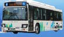

   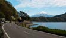

10. **16:25 — Arrive Fuji Subaru Line 5th Station (a.k.a. Yoshidaguchi 5th / Kawaguchiko 5th Station)**
    - (35.3965, 138.7325)
    - Yoshida Trail halfway point. Entrance fee ¥2,000/person — included.

   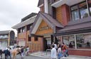

   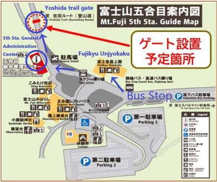

11. **Check in at Fujikyu Unjokaku (富士急雲上閣); show QR ticket + Unjokaku reservation email at 5th Station General Administration Center (24-hour).** Receive wristband (needed for descent). The Yoshida Trail gate is closed 16:00–03:00 but wristbanded climbers may enter at night.

   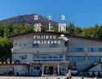

12. **Dinner:** excluded.

13. **21:00–02:00 — Begin climb (no guide; ~6–8 h to summit).**
    - Expected sunrise ≈04:30; for summit sunrise depart 21:00–22:00.
    - From the 7th station up, sunrise is visible even without reaching the summit.
    - At 3,776 m / 12,388 ft — serious elevation gain; weather is volatile (thunderstorms, hail, snow possible). Bring proper gear.
    - Official site: https://www.fujisan-climb.jp/en/index.html

14. **Accommodation — Fujikyu Unjokaku (富士急雲上閣) — Capsule / Pod Hotel**
    - Fuji Subaru Line 5th Station, Narusawa, Minamitsuru, Yamanashi 401-0320
    - (35.3967, 138.7326)
    - 4 rooms of capsule hotel; coin showers by gender (¥500 / 5 min); 310 large/medium/small lockers (locked inside the building 17:00–09:00 — can't retrieve overnight).

   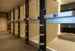

---

## DAY 13 — Tuesday, 2 July 2024 — Mt. Fuji summit + descent + back to Tokyo (Setagaya)

**Includes:** apartment accommodation · highway bus ticket Fuji Subaru Line 5th Station → Shinjuku Station (advance reservation required) — included.

**Overview:** Reach summit (Kengamine 3,776 m); descend by 10:00; bus to Shinjuku; Odakyu train to Soshigaya-Okura; taxi to Yamato Seijo Office to pick up luggage; taxi to Setagaya apartment.

### Items

1. **Check out of Fujikyu Unjokaku.** (No guide.)
2. **21:00 (prev day) – 02:00 — Continue climb to summit via Yoshida Trail** — highest peak Kengamine 剣ヶ峰 3,776 m.
   - Summit: (35.3606, 138.7274)
   - Ascent ~7–8 h, descent ~3–5 h.

   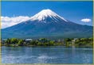

3. **Breakfast:** excluded.
4. **06:30–10:00 — Descend to Fuji Subaru Line 5th Station (3–5 h). Start descending no later than 10:00.**
5. **Lunch:** excluded. Rest/eat at 5th-station restaurant.
6. **Highway bus Fuji Subaru Line 5th Station → Shinjuku Station (≈2 h 35 min)** — advance reservation required, included. Choose your boarding time:
    - ① 12:00 → 14:35
    - ② 12:30 → 15:05
    - ③ 13:00 → 15:35
    - ④ 14:00 → 16:35
    - ⑤ 15:00 → 17:35
    - ⑥ 16:00 → 18:35

7. **Arrive Shinjuku Expressway Bus Terminal (Busta Shinjuku, バスタ新宿).**
   - (35.6879, 139.7001)

8. **Walk ≈5 min to Shinjuku Station (Odakyu Line — not JR).**
9. **Odakyu line Shinjuku → Soshigaya-Okura Station (成城学園前… note: destination is 祖師ヶ谷大蔵駅; ≈21 min)** — IC card.
   - Soshigaya-Okura Station: (35.6502, 139.5975)
10. **Taxi to Yamato Transport Seijo Office (~10 min each way, pay on site)** — pick up your shipped luggage. Closes 21:00.
    - Yamato Transport Seijo Office, 1-4-19 Seijo, Setagaya-ku, Tokyo 157-0066
    - (35.6475, 139.6039)
    - https://maps.app.goo.gl/R7d88ZoL4xEzeeFU8
11. **Taxi from Yamato → apartment (~10 min, pay on site).** Check in. **Dinner:** excluded.
12. **Accommodation — Apartment in Setagaya-ku (Soshigaya)**
    - 3 Chome-24-5 Soshigaya 2F, Setagaya-ku, Tokyo 157-0072
    - (35.6487, 139.5950)
    - Room: 1 double bed, 2 single beds, 1 futon, 1 sofa bed.

   

---

## DAY 14 — Wednesday, 3 July 2024 — Tokyo free day

**Includes:** apartment accommodation.

**Overview:** Unstructured free day in Tokyo — explore, eat, reflect.

### Items

1. **Self-guided.** Breakfast/Lunch/Dinner: excluded.
2. **Accommodation — Apartment in Setagaya-ku (Soshigaya)** (same as Day 13).
    - 3 Chome-24-5 Soshigaya 2F, Setagaya-ku, Tokyo 157-0072
    - (35.6487, 139.5950)

   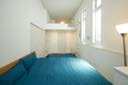

---

## DAY 15 — Thursday, 4 July 2024 — Departure

**Overview:** Fly home from Haneda on Delta DL276.

### Items

1. **10:00 — Check out of Setagaya apartment.** Breakfast/Lunch: excluded.
2. **Train to Haneda Airport** — IC card (no JR Pass on final day).
   - Haneda Airport: (35.5494, 139.7798)
   - Arrive at least 2 hours before flight.
3. **15:25 — Depart Haneda on Delta DL276.** Dinner: excluded.

---

## Appendices

### Transport / Pass Summary

- JR Pass (14-day) — JR pass-1 through JR pass-14 (Day 15 no pass).
- IC Card (Suica/Pasmo equivalent) — loaded ¥15,000 at arrival.
- Highway buses — Hatchobori↔Tadanoumi, Mishima→Kawaguchiko, Fuji 5th→Shinjuku.
- Ferries — Miyajimaguchi↔Miyajima (JR), Tadanoumi↔Okunoshima (guide pays).
- Taxis — Kyoto apartment→Kyoto Station; Soshigaya-Okura↔Yamato Seijo (arrange + pay on site).

### Accommodations at a glance

| Nights | Place | Address | Coordinates |
|---|---|---|---|
| Days 1–4 (4 nt) | Apartment in Shin-Nakano | 401 Central Field, 6-21-16 Honmachi, Nakano-ku, Tokyo | (35.6930, 139.6662) |
| Days 5–6 (2 nt) | RESI STAY Apartment Kyoto | 558-9 Motoshiogamachō, Shimogyō-ku, Kyoto | (34.9889, 135.7575) |
| Days 7–9 (3 nt) | Apartment Hiroshima | #402 Nikkei Building, 12-2 Hatchōbori, Naka-ku, Hiroshima 730-0013 | (34.3953, 132.4638) |
| Day 10 (1 nt) | Waqoo Shitaderamachi (Shukubo) | 2-17-8 Shitaderamachi, Tennoji-ku, Osaka 543-0076 | (34.6584, 135.5178) |
| Day 11 (1 nt) | Apartment in Osaka | 1-6-4 Shikitsunishi 3F, Naniwa-ku, Osaka 556-0015 | (34.6488, 135.4913) |
| Day 12 (1 nt) | Fujikyu Unjokaku (capsule) | Fuji Subaru Line 5th Station, Narusawa, Yamanashi 401-0320 | (35.3967, 138.7326) |
| Days 13–14 (2 nt) | Apartment in Setagaya | 3-24-5 Soshigaya 2F, Setagaya-ku, Tokyo 157-0072 | (35.6487, 139.5950) |

### Guides & Assistants

| Day(s) | Role | Name | Phone |
|---|---|---|---|
| 1 | Airport assistant | Mr. Takebayashi Kei | 080-3094-0463 |
| 2 | Tour guide (Tokyo) | Mr. Takebayashi Kei | 080-3094-0463 |
| 4 | Tour guide (Tokyo) | Mr. Kei Takebayashi | 080-3094-0463 |
| 8 | Tour guide (Miyajima) | Mr. Eijiro Kurisaka | 090-6832-1953 |
| 9 (AM) | Tour assistant (Hiroshima) | Ms. Twombly Mika | 050-1808-2269 |
| 9 (day) | Tour guide (Takehara/Okunoshima) | Ms. Junko Mills | 090-6960-2158 |

### Source

Extracted from *2024_06.20 Semi-Final Itinerary — Christopher Myers (as of 07 JUN)* PDF provided by Heartland JAPAN via Outdoor Voyage.
